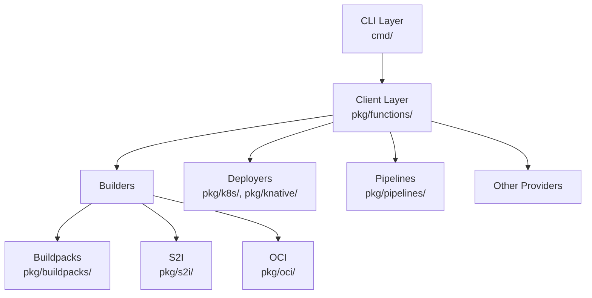
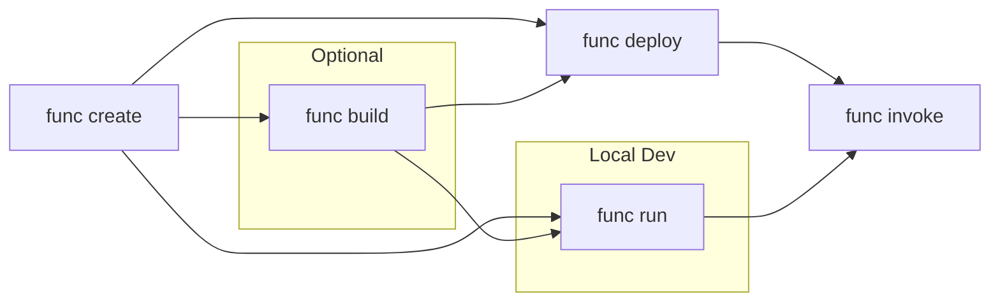

# Architecture

## High level overview

Knative Func is a CLI that simplifies building and deploying serverless functions
on Kubernetes. Instead of writing Dockerfiles and Kubernetes manifests,
developers run `func create`, `func build`, and `func deploy`. The CLI handles
image building (via Buildpacks, S2I, or direct OCI), registry pushing, and
Knative Service creation or newly available bare K8s deployement.

## Code Map

```
cmd/                    # CLI commands (Cobra) - START HERE
  func/main.go          # Entry point
  build.go, deploy.go   # Individual commands

pkg/
  functions/            # Core library - the "brain"
    client.go           # Central orchestrator, defines all interfaces
    function.go         # Function type representing a project

  buildpacks/           # Pack/Cloud Native Buildpacks builder (in container)
  s2i/                  # Source-to-Image builder (in container)
  oci/                  # Direct OCI image builder (on host)

  knative/              # Knative Serving deployer
  k8s/                  # Kubernetes utilities

  pipelines/tekton/     # Remote builds via Tekton
  mcp/                  # AI agent integration (MCP server)

templates/              # Function scaffolding (go, node, python, etc.)
generate/               # Embedded filesystem (generated)
schema/                 # JSON schemas
```

## Entry Point

```
cmd/func/main.go
    └── pkg/app.Main()
        └── cmd.NewRootCmd()
            └── Individual commands (build, deploy, create, ...)
```

Commands in `cmd/` are thin wrappers. They parse flags, create a `Client`, and delegate to `pkg/functions/client.go`:

```go
// Typical command pattern
client, _ := fn.New(fn.WithBuilder(buildpacks.NewBuilder()))
client.Build(ctx, f)
```

## Key Search Terms

When exploring the codebase, search for these:

| Term | Where | What it does |
|------|-------|--------------|
| `fn.Client` | `pkg/functions/client.go` | Main client type for all operations |
| `NewClient` | `cmd/client.go` | Creates fully-configured client |
| `ClientFactory` | `cmd/root.go` | Function type for client creation |
| `Builder` | `pkg/functions/client.go` | Interface for function builders |
| `Deployer` | `pkg/functions/client.go` | Interface for function deployers |
| `Function` | `pkg/functions/function.go` | Type representing a function |

## Layer Architecture



### CLI Layer (`cmd/`)

- Cobra commands: build.go, deploy.go, create.go, run.go, delete.go, etc.
- Handles flags, user prompts, output formatting
- Delegates all business logic to Client

### Client Layer (`pkg/functions/`)

- `client.go`: Central orchestrator for all function operations
- Defines core interfaces: Builder, Pusher, Deployer, Runner, Remover, Lister, Describer
- `function.go`: Function type representing a function project

### Builders

Implement the `Builder` interface (source → OCI image):
- `pkg/buildpacks/`: Cloud Native Buildpacks via Pack
- `pkg/s2i/`: Red Hat Source-to-Image
- `pkg/oci/`: Direct OCI image building on host

### Deployers

- `pkg/knative/`: Creates/updates Knative Services
- `pkg/k8s/`: Kubernetes utilities & Services

## Function Lifecycle



| Stage | Client Method | Description |
|-------|---------------|-------------|
| Create | `Init()` | Create boilerplate project from template |
| Scaffold | `Scaffold()` | Scaffold project as a service|
| Build | `Build()` | Produce OCI image via Builder |
| Deploy | `Deploy()` | Push image, create K8s/Knative Service |
| Run | `Run()` | Local execution for development |
| Invoke | `Invoke()` | Send request to deployed function |

## Key Interfaces

Defined in `pkg/functions/client.go`:

| Interface | Purpose |
|-----------|---------|
| `Builder` | Source → OCI image |
| `Pusher` | Image → Registry |
| `Deployer` | Image → Service on K8s |
| `Runner` | Local execution |
| `Remover` | Delete deployed function |
| `Lister` | List deployed functions |
| `Describer` | Describe function instances |
| `PipelinesProvider` | Remote build orchestration |

## Subsystems

### Pipelines (Remote Builds)

Located in `pkg/pipelines/tekton/`. Enables `func deploy --remote` to build on-cluster via Tekton instead of locally. Supports Pipelines-as-Code (PAC) for GitOps workflows.

### MCP Server

Located in `pkg/mcp/`. Started via `func mcp start` (Agents should run this). Allows AI agents (Claude Code, Cursor) to create/build/deploy functions programmatically. Read-only by default; set `FUNC_ENABLE_MCP_WRITE=true` for full access.

### Configuration

- `func.yaml`: Function metadata, build/deploy options, environment variables. Schema: `schema/func_yaml-schema.json`
- Templates in `templates/` embedded at build time into `generate/zz_filesystem_generated.go`
- Runtimes: go, node, python, rust, quarkus, springboot, typescript
- Invocation styles: http, cloudevents
